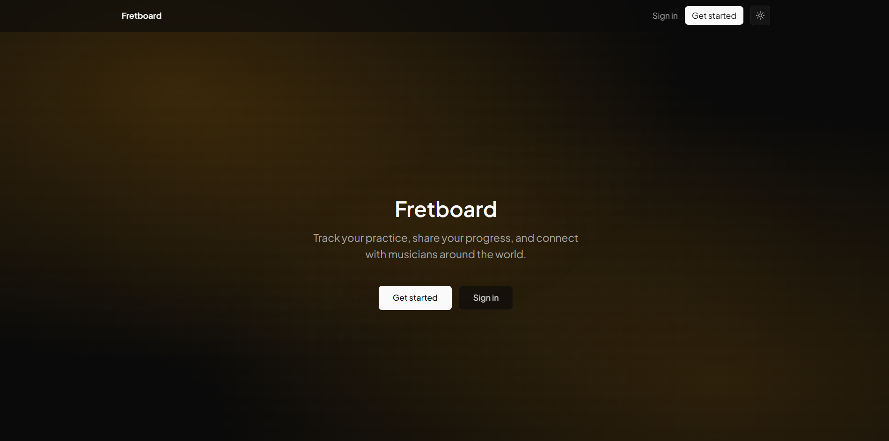
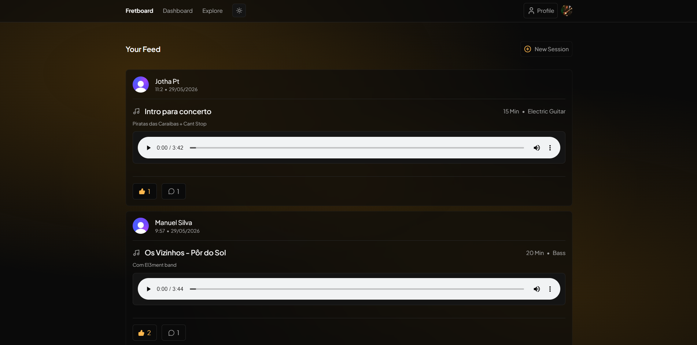
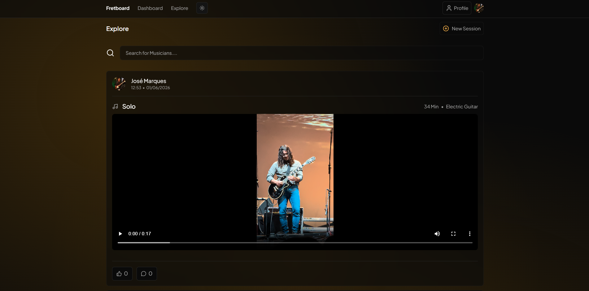
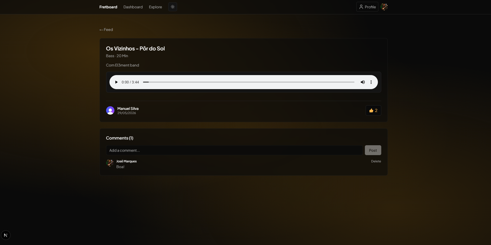
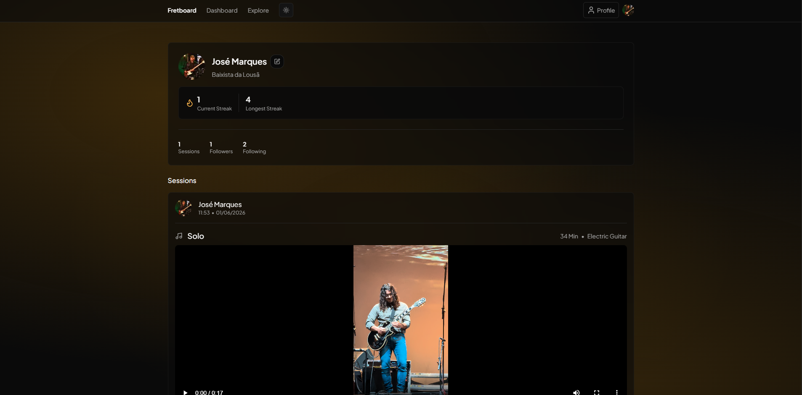
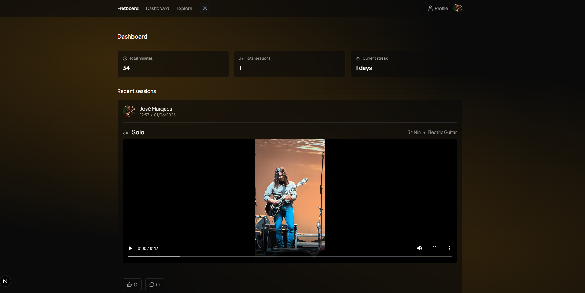

# Fretboard

> A social platform for musicians to track practice sessions, share progress, and connect with others.



**Live Demo → [fretboard-app-xi.vercel.app](https://fretboard-app-xi.vercel.app)**

---

## About

Fretboard was built as a full-stack portfolio project to demonstrate real-world development skills. The idea came from a personal need — as a bass player, I wanted a place to log practice sessions, share clips, and follow other musicians' progress.

The app supports multiple instruments, audio/video uploads, a social feed, follows, likes, comments, and streak tracking.

---

## Screenshots

| Feed                            | Explore                               |
| ------------------------------- | ------------------------------------- |
|  |  |

| Session Detail                        | Profile                               |
| ------------------------------------- | ------------------------------------- |
|  |  |



---

## Tech Stack

| Layer        | Technology              | Why                                                 |
| ------------ | ----------------------- | --------------------------------------------------- |
| Framework    | Next.js 16 (App Router) | Server Components, Server Actions, streaming        |
| Language     | TypeScript              | Type safety throughout the stack                    |
| Database     | PostgreSQL (Neon)       | Relational data, serverless-friendly                |
| ORM          | Drizzle ORM             | TypeScript-first, lightweight, great for serverless |
| Auth         | Clerk                   | Complete auth solution with webhooks                |
| File Storage | Cloudflare R2           | S3-compatible, generous free tier                   |
| Styling      | Tailwind CSS v4         | Utility-first, custom design tokens                 |
| Deploy       | Vercel                  | Seamless Next.js deployment                         |

---

## Features

### Core

- 🎸 Multi-instrument support
- 📝 Practice session logging with title, duration, and notes
- 🎵 Audio and video clip uploads per session
- 🔥 Streak tracking — consecutive days of practice

### Social

- 👥 Follow other musicians
- 📰 Personalised feed — sessions from people you follow
- 🌍 Global explore feed with user search
- ❤️ Like and comment on sessions
- 👤 Public profile pages with instrument badges

### UX

- 🌙 Dark mode by default, toggleable
- 📱 Fully responsive with mobile navigation
- ⚡ Streaming loading with Suspense and skeletons
- ✏️ Inline profile editing

---

## Architecture Highlights

**Server Components by default** — data fetching happens on the server, keeping the client bundle minimal and avoiding unnecessary loading states.

**Server Actions** — form submissions and mutations are handled via Next.js Server Actions, eliminating the need for traditional API routes in most cases.

**Drizzle ORM** — chosen over Prisma for its TypeScript-first approach, lightweight footprint, and better cold-start performance in serverless environments.

**Presigned URLs for uploads** — files are uploaded directly from the browser to Cloudflare R2 using presigned URLs. The server generates a temporary signed URL with credentials; the browser uploads directly to R2 without the file ever passing through the server.

**Optimistic updates** — likes and follows update instantly in the UI before the server confirms, with automatic rollback on error.

---

## Database Schema

```
users           — profile, synced with Clerk via webhook
userInstruments — instruments per user with favourite flag
sessions        — practice sessions with optional media
sessionLikes    — likes (user → session)
sessionComments — comments with user relation
follows         — asymmetric follow system (like Instagram)
streaks         — current and longest streak per user
```

---

## Getting Started

### Prerequisites

- Node.js 18+
- pnpm
- [Neon](https://neon.tech) account (PostgreSQL)
- [Clerk](https://clerk.com) account (Auth)
- [Cloudflare R2](https://cloudflare.com) account (File storage)

### Installation

```bash
# Clone the repository
git clone https://github.com/teu-username/fretboard.git
cd fretboard

# Install dependencies
pnpm install

# Set up environment variables
cp .env.example .env
# Fill in your keys

# Run database migrations
npx drizzle-kit migrate

# Start the development server
pnpm dev
```

### Environment Variables

```env
# Database
DATABASE_URL=

# Clerk
NEXT_PUBLIC_CLERK_PUBLISHABLE_KEY=
CLERK_SECRET_KEY=
NEXT_PUBLIC_CLERK_SIGN_IN_URL=/sign-in
NEXT_PUBLIC_CLERK_SIGN_UP_URL=/sign-up
NEXT_PUBLIC_CLERK_AFTER_SIGN_IN_URL=/feed
NEXT_PUBLIC_CLERK_AFTER_SIGN_UP_URL=/feed
CLERK_WEBHOOK_SECRET=

# Cloudflare R2
R2_ACCOUNT_ID=
R2_ACCESS_KEY_ID=
R2_SECRET_ACCESS_KEY=
R2_BUCKET_NAME=fretboard-media
R2_PUBLIC_URL=
```

---

## Project Structure

```
src/
├── app/                  # Next.js App Router — pages and API routes
│   ├── (pages)/          # feed, explore, dashboard, profile, sessions
│   └── api/              # upload endpoint, Clerk webhook
├── actions/              # Server Actions — all data mutations and queries
├── components/           # React components
│   ├── skeletons/        # Loading skeleton components
│   └── ui/               # Shared UI components
├── db/                   # Drizzle schema, client, migrations
├── lib/                  # External service clients (R2, auth helper)
├── utils/                # Pure utility functions (streak calculation)
└── constants/            # Static data (instruments list)
```

---

## What I Learned

- Structuring a full-stack Next.js application with the App Router
- The difference between Server Components, Client Components, and Server Actions
- Relational database design with foreign keys, cascade deletes, and joins
- Integrating third-party services (Clerk, Cloudflare R2) in a production-ready way
- Implementing presigned URL file uploads without exposing credentials
- Optimistic UI updates with automatic error rollback
- Streaming loading with React Suspense for better perceived performance
- Working with Git branches and conventional commits

---

## License

MIT
